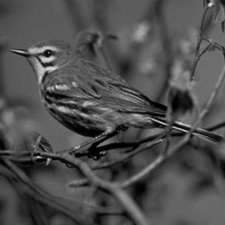
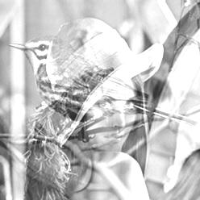
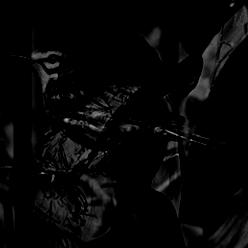
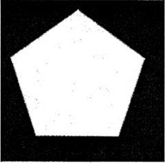
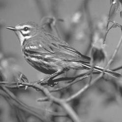
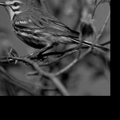
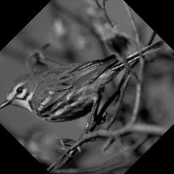
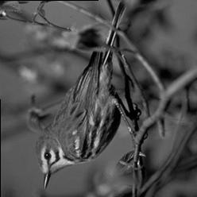
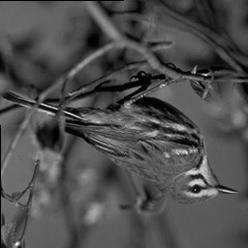

# Tugas ke-3 Pengolahan Citra (Individu)

Nama : Defrian Afandi                                          
NIM  : 09021281722075                                                            
Jurusan : Teknik Informatika

Untuk implementasi operasi-operasi citra pada program, saya menggunakan bahasa                             
pemrograman Python 3 dan library PIL (Python Image Library) pada python.

untuk menginstall library-nya, jalankan command berikut:

```
pip3 install pillow
```

## Operasi Aritmatika

### - Penjumlahan Dua Buah Citra (Citra A dan B)

untuk melakukan penjumlahan dua buah citra, berikut programnya:

```python
from PIL import Image

def clipping(intensitas):
    if intensitas < 0:
        return 0
    if intensitas > 255:
        return 255
    return intensitas

def penambahan_dua_citra(citra_A, citra_B, citra_hasil):
    # pastikan ukuran citra A dan citra B sama :)
    CITRA_A = Image.open(citra_A)
    PIXEL_A = CITRA_A.load()

    CITRA_B = Image.open(citra_B)
    PIXEL_B = CITRA_B.load()

    ukuran_horizontal = CITRA_A.size[0]
    ukuran_vertikal = CITRA_A.size[1]

    CITRA_HASIL = Image.new("RGB", (ukuran_horizontal, ukuran_vertikal))
    PIXEL_HASIL = CITRA_HASIL.load()

    for x in range(ukuran_horizontal):
        for y in range(ukuran_vertikal):
            R = clipping(PIXEL_A[x, y][0] + PIXEL_B[x, y][0])
            G = clipping(PIXEL_A[x, y][1] + PIXEL_B[x, y][1])
            B = clipping(PIXEL_A[x, y][2] + PIXEL_B[x, y][2])
            PIXEL_HASIL[x, y] = (R, G, B)

    CITRA_HASIL.save(citra_hasil)


penambahan_dua_citra('gambar1.jpg', 'gambar2.jpg',
                      'gambar_hasil_penambahan.jpg')
```

|Citra A                        | Citra B                    |          
| ----------------------------- | -------------------------- |
|     |  |
|                               |                            |


Setelah dilakukan operasi penambahan dua buah citra :                           


### - Pengurangan Dua Buah Citra (Citra A dan B)

untuk melakukan pengurangan dua buah citra, berikut programnya:

```python
from PIL import Image

def clipping(intensitas):
    if intensitas < 0:
        return 0
    if intensitas > 255:
        return 255
    return intensitas

def pengurangan_dua_citra(citra_A, citra_B, citra_hasil):
    # pastikan ukuran citra A dan citra B sama :)
    CITRA_A = Image.open(citra_A)
    PIXEL_A = CITRA_A.load()

    CITRA_B = Image.open(citra_B)
    PIXEL_B = CITRA_B.load()

    ukuran_horizontal = CITRA_A.size[0]
    ukuran_vertikal = CITRA_A.size[1]

    CITRA_HASIL = Image.new("RGB", (ukuran_horizontal, ukuran_vertikal))
    PIXEL_HASIL = CITRA_HASIL.load()

    for x in range(ukuran_horizontal):
        for y in range(ukuran_vertikal):
            R = clipping(PIXEL_A[x, y][0] - PIXEL_B[x, y][0])
            G = clipping(PIXEL_A[x, y][1] - PIXEL_B[x, y][1])
            B = clipping(PIXEL_A[x, y][2] - PIXEL_B[x, y][2])
            PIXEL_HASIL[x, y] = (R, G, B)

    CITRA_HASIL.save(citra_hasil)


pengurangan_dua_citra('gambar1.jpg', 'gambar2.jpg',
                      'gambar_hasil_pengurangan.jpg')
```

Masih menggunakan dua buah citra yang sama. Setelah dilakukan operasi-                               
pengurangan dua buah citra, hasilnya :                           


### - Perkalian Dua Buah Citra (Citra A dan B)

untuk melakukan perkalian dua buah citra, berikut programnya:
```python
from PIL import Image
from math import sqrt

def clipping(intensitas):
    if intensitas < 0:
        return 0
    if intensitas > 255:
        return 255
    return intensitas

def perkalian_dua_citra(citra_A, citra_B, citra_hasil):
    # pastikan ukuran citra A dan citra B sama :)
    CITRA_A = Image.open(citra_A)
    PIXEL_A = CITRA_A.load()

    CITRA_B = Image.open(citra_B)
    PIXEL_B = CITRA_B.load()

    ukuran_horizontal = CITRA_A.size[0]
    ukuran_vertikal = CITRA_A.size[1]

    CITRA_HASIL = Image.new("RGB", (ukuran_horizontal, ukuran_vertikal))
    PIXEL_HASIL = CITRA_HASIL.load()

    for x in range(ukuran_horizontal):
        for y in range(ukuran_vertikal):
            R = clipping(int(sqrt(PIXEL_A[x, y][0] * PIXEL_B[x, y][0])))
            G = clipping(int(sqrt(PIXEL_A[x, y][1] * PIXEL_B[x, y][1])))
            B = clipping(int(sqrt(PIXEL_A[x, y][2] * PIXEL_B[x, y][2])))
            PIXEL_HASIL[x, y] = (R, G, B)

    CITRA_HASIL.save(citra_hasil)


perkalian_dua_citra('sample1.jpg', 'sample2.jpg','gambar_hasil_perkalian.jpg')

```
|Citra A                        | Citra B                    |          
| ----------------------------- | -------------------------- |
|     |  |
|                               |                            |


Setelah dilakukan operasi perkalian dua buah citra :                           


### - Pembagian Dua Buah Citra (Citra A dan B)

untuk melakukan pembagian dua buah citra, berikut programnya:
```python
from PIL import Image

def clipping(intensitas):
    if intensitas < 0:
        return 0
    if intensitas > 255:
        return 255
    return intensitas

def pembagian_dua_citra(citra_A, citra_B, citra_hasil):
    # pastikan ukuran citra A dan citra B sama :)
    CITRA_A = Image.open(citra_A)
    PIXEL_A = CITRA_A.load()

    CITRA_B = Image.open(citra_B)
    PIXEL_B = CITRA_B.load()

    ukuran_horizontal = CITRA_A.size[0]
    ukuran_vertikal = CITRA_A.size[1]

    CITRA_HASIL = Image.new("RGB", (ukuran_horizontal, ukuran_vertikal))
    PIXEL_HASIL = CITRA_HASIL.load()

    for x in range(ukuran_horizontal):
        for y in range(ukuran_vertikal):
            if PIXEL_B[x, y][0] != 0: 
                R = clipping(int(PIXEL_A[x, y][0] / PIXEL_B[x, y][0]))
            else :
                R = 0
            if PIXEL_B[x, y][1] != 0:
                G = clipping(int(PIXEL_A[x, y][1] / PIXEL_B[x, y][1]))
            else:
                G = 0
            if PIXEL_B[x, y][2] != 0:
                B = clipping(int(PIXEL_A[x, y][2] / PIXEL_B[x, y][2]))
            else:
                B = 0
            PIXEL_HASIL[x, y] = (R, G, B)

    CITRA_HASIL.save(citra_hasil)


pembagian_dua_citra('sample1.jpg', 'sample2.jpg',
                    'gambar_hasil_pembagian.jpg')

```
|Citra A                        | Citra B                    |          
| ----------------------------- | -------------------------- |
|     |  |
|                               |                            |


Setelah dilakukan operasi pembagian dua buah citra :                           


### - Penambahan Citra dengan skalar

untuk operasi ini, berikut programnya:

```python
from PIL import Image

def clipping(intensitas):
    if intensitas < 0:
        return 0
    if intensitas > 255:
        return 255
    return intensitas

def penambahan_citra_skalar(nilai_skalar):
    CITRA = Image.open('gambar1.jpg')
    PIXEL = CITRA.load()

    ukuran_horizontal = CITRA.size[0]
    ukuran_vertikal = CITRA.size[1]

    for x in range(ukuran_horizontal):
        for y in range(ukuran_vertikal):
            R = clipping(PIXEL[x, y][0] + nilai_skalar)
            G = clipping(PIXEL[x, y][1] + nilai_skalar)
            B = clipping(PIXEL[x, y][2] + nilai_skalar)
            PIXEL[x, y] = (R, G, B)

    nama_gambar = 'penambahan_skalar_' + str(nilai_skalar) +'.jpg'
    CITRA.save(nama_gambar)


penambahan_citra_skalar(50)
```

Citra sebelum di operasi penambahan dengan skalar :                                       
 

Dengan skalar +50:                                                                       



### - Pengurangan Citra dengan skalar

untuk operasi ini, berikut programnya:

```python
from PIL import Image

def clipping(intensitas):
    if intensitas < 0:
        return 0
    if intensitas > 255:
        return 255
    return intensitas

def pengurangan_citra_skalar(nilai_skalar):
    CITRA = Image.open('gambar1.jpg')
    PIXEL = CITRA.load()

    ukuran_horizontal = CITRA.size[0]
    ukuran_vertikal = CITRA.size[1]

    for x in range(ukuran_horizontal):
        for y in range(ukuran_vertikal):
            R = clipping(PIXEL[x, y][0] - nilai_skalar)
            G = clipping(PIXEL[x, y][1] - nilai_skalar)
            B = clipping(PIXEL[x, y][2] - nilai_skalar)
            PIXEL[x, y] = (R, G, B)

    namaGmbr = 'pengurangan_skalar_' +str(nilai_skalar) +'.jpg'
    CITRA.save(namaGmbr)


pengurangan_citra_skalar(50)
```

Citra sebelum di operasi pengurangan dengan skalar :                                       
 

Dengan skalar -50:                                                                       


### - Perkalian Citra dengan skalar

untuk operasi ini, berikut programnya:

```python
from PIL import Image

def clipping(intensitas):
    if intensitas < 0:
        return 0
    if intensitas > 255:
        return 255
    return intensitas

def perkalian_citra_skalar(nilai_skalar):
    CITRA = Image.open('gambar1.jpg')
    PIXEL = CITRA.load()

    ukuran_horizontal = CITRA.size[0]
    ukuran_vertikal = CITRA.size[1]

    for x in range(ukuran_horizontal):
        for y in range(ukuran_vertikal):
            R = clipping(int(PIXEL[x, y][0] * nilai_skalar))
            G = clipping(int(PIXEL[x, y][1] * nilai_skalar))
            B = clipping(int(PIXEL[x, y][2] * nilai_skalar))
            PIXEL[x, y] = (R, G, B)

    namaGmbr = 'perkalian_skalar_' +str(nilai_skalar).replace('.', ',') +'.jpg'
    CITRA.save(namaGmbr)

perkalian_citra_skalar(1.5)
```

Citra sebelum di operasi perkalian dengan skalar :                                       
 

dikali dengan skalar 1,5:                                                                       


### - Pembagian Citra dengan skalar

untuk operasi ini, berikut programnya:

```python
from PIL import Image

def clipping(intensitas):
    if intensitas < 0:
        return 0
    if intensitas > 255:
        return 255
    return intensitas

def pembagian_citra_skalar(nilai_skalar):
    CITRA = Image.open('gambar1.jpg')
    PIXEL = CITRA.load()

    ukuran_horizontal = CITRA.size[0]
    ukuran_vertikal = CITRA.size[1]

    for x in range(ukuran_horizontal):
        for y in range(ukuran_vertikal):
            if nilai_skalar != 0 :
                R = clipping(int(PIXEL[x, y][0] / nilai_skalar))
                G = clipping(int(PIXEL[x, y][1] / nilai_skalar))
                B = clipping(int(PIXEL[x, y][2] / nilai_skalar))
                PIXEL[x, y] = (R, G, B)
            else :
                nilai_skalar = 1
                R = clipping(int(PIXEL[x, y][0] / nilai_skalar))
                G = clipping(int(PIXEL[x, y][1] / nilai_skalar))
                B = clipping(int(PIXEL[x, y][2] / nilai_skalar))
                PIXEL[x, y] = (R, G, B)


    namaGmbr = 'pembagian_skalar_' +str(nilai_skalar).replace('.', ',') +'.jpg'
    CITRA.save(namaGmbr)

pembagian_citra_skalar(1.5)
```

Citra sebelum di operasi pembagian dengan skalar :                                       
 

dibagi dengan skalar 1,5:                                                                       


## Operasi Geometri

### - Translasi Citra

Berikut implementasi translasi citra dalam python:

```python
from PIL import Image
def translasi(m, n):
    CITRA = Image.open('gambar.jpg')
    PIXEL = CITRA.load()

    ukuran_horizontal = CITRA.size[0]
    ukuran_vertikal = CITRA.size[1]

    CITRA_BARU = Image.new("RGB",(ukuran_horizontal, ukuran_vertikal))
    PIXEL_BARU = CITRA_BARU.load()

    start_m = m
    start_n = n

    if m < 0:
        start_m = 0
    if n < 0:
        start_n = 0

    for x in range(start_m, ukuran_horizontal):
        for y in range(start_n, ukuran_vertikal):
            x_baru = x - m
            y_baru = y - n
       
            if (x_baru >= ukuran_horizontal or y_baru >= ukuran_vertikal 
                            or x_baru < 0 or y_baru < 0):
                PIXEL_BARU[x, y] = (0, 0, 0)
            else:
                PIXEL_BARU[x, y]= PIXEL[x_baru, y_baru]

    nama_gambar = 'gambar_translasi_' + str(m) + '_' + str(n) +'.jpg'
    CITRA_BARU.save(nama_gambar)

translasi(25, 50)
translasi(-20, -50)
```

Berikut hasil translasi(25, 50):                                                     


Berikut hasil translasi(-20, -50):                                                              


### - Rotasi Citra

Berikut implementasi rotasi citra dalam python:

```python
from PIL import Image
from math import sin, cos


def rotasi(derajat):
    CITRA = Image.open('gambar1.jpg')
    PIXEL = CITRA.load()

    ukuran_horizontal = CITRA.size[0]
    ukuran_vertikal = CITRA.size[1]

    CITRA_BARU = Image.new("RGB", (ukuran_horizontal, ukuran_vertikal))
    PIXEL_BARU = CITRA_BARU.load()

    x_tengah = ukuran_horizontal // 2
    y_tengah = ukuran_vertikal // 2

    for x in range(ukuran_horizontal):
        for y in range(ukuran_vertikal):
            # theta == radian
            theta = derajat * 22/7 / 180

            # rumus rotasi dengan pusat rotasi bebas (disini tengah)
            # sumber: https://homepages.inf.ed.ac.uk/rbf/HIPR2/rotate.htm
            x_baru = (cos(theta) * (x - x_tengah) - sin(theta)
                      * (y - y_tengah) + x_tengah)
            y_baru = (sin(theta) * (x - x_tengah) + cos(theta)
                      * (y - y_tengah) + y_tengah)

            # rumus rotasi dengan pusat rotasi (0, 0)
            # dari buku rinaldi munir
            # x_baru = x*cos(theta) - y*sin(theta)
            # y_baru = x*cos(theta) + y*cos(theta)

            if (x_baru >= ukuran_horizontal or y_baru >= ukuran_vertikal
                    or x_baru < 0 or y_baru < 0):
                PIXEL_BARU[x, y] = (0, 0, 0)
            else:
                PIXEL_BARU[x, y] = PIXEL[x_baru, y_baru]

    nama_setelah_disave = 'gambar_rotasi_' + str(derajat) + '.jpg'
    CITRA_BARU.save(nama_setelah_disave)


rotasi(45)
rotasi(90)
rotasi(180)
```

Berikut hasil setelah di Rotasi 45°:                                                         


Berikut hasil setelah di Rotasi 90°:                                                        


Berikut hasil setelah di Rotasi 180°:                                                            


### - Dilatasi Citra

Berikut implementasi dilatasi citra dalam python:

```python
from PIL import Image
from math import floor

def skala(s):
    CITRA = Image.open('gambar2.jpg')
    PIXEL = CITRA.load()

    ukuran_horizontal = CITRA.size[0]
    ukuran_vertikal = CITRA.size[1]

    ukuran_horizontal_baru = floor(ukuran_horizontal * s)
    ukuran_vertikal_baru = floor(ukuran_vertikal * s)
    
    CITRA_BARU = Image.new("RGB",(ukuran_horizontal_baru, ukuran_vertikal_baru))
    PIXEL_BARU = CITRA_BARU.load()

    for x in range(ukuran_horizontal_baru):
        for y in range(ukuran_vertikal_baru):
            x_lama = ukuran_horizontal * x / ukuran_horizontal_baru
            y_lama = ukuran_vertikal * y / ukuran_vertikal_baru
            PIXEL_BARU[x, y] = PIXEL[x_lama, y_lama]

    nama_gambar = 'gambar_dilatasi_skala_' + str(s).replace('.', ',') + '.jpg'
    CITRA_BARU.save(nama_gambar)

skala(0.7)
skala(1.6)
```
Berikut Gambar asli:                                                                     


Hasil dilatasi dengan skala 0,7:                                                       


Hasil dilatasi dengan skala 1,6:                                                             


### - Flipping Citra 

Berikut implementasi flipping citra dalam python:

```python
from PIL import Image

def flipping_vertikal(gambar, nama_setelah_disave):
    CITRA = Image.open(gambar)
    PIXEL = CITRA.load()

    ukuran_horizontal = CITRA.size[0]
    ukuran_vertikal = CITRA.size[1]

    CITRA_BARU = Image.new("RGB", (ukuran_horizontal, ukuran_vertikal))
    PIXEL_BARU = CITRA_BARU.load()

    for x in range(ukuran_horizontal):
        for y in range(ukuran_vertikal):
            PIXEL_BARU[x, y] = PIXEL[x, ukuran_vertikal - 1 - y]

    CITRA_BARU.save(nama_setelah_disave)

def flipping_horizontal(gambar, nama_setelah_disave):
    CITRA = Image.open(gambar)
    PIXEL = CITRA.load()

    ukuran_horizontal = CITRA.size[0]
    ukuran_vertikal = CITRA.size[1]

    CITRA_BARU = Image.new("RGB", (ukuran_horizontal, ukuran_vertikal))
    PIXEL_BARU = CITRA_BARU.load()

    for x in range(ukuran_horizontal):
        for y in range(ukuran_vertikal):
            PIXEL_BARU[x, y] = PIXEL[ukuran_horizontal - 1 - x, y]

    CITRA_BARU.save(nama_setelah_disave)

def flipping_titik_asal(gambar, nama_setelah_disave):
    CITRA = Image.open(gambar)
    PIXEL = CITRA.load()

    ukuran_horizontal = CITRA.size[0]
    ukuran_vertikal = CITRA.size[1]

    CITRA_BARU = Image.new("RGB", (ukuran_horizontal, ukuran_vertikal))
    PIXEL_BARU = CITRA_BARU.load()

    for x in range(ukuran_horizontal):
        for y in range(ukuran_vertikal):
            PIXEL_BARU[x, y] = PIXEL[ukuran_horizontal - 1 - x,
                                             ukuran_vertikal -1 -y]

    CITRA_BARU.save(nama_setelah_disave)

flipping_vertikal('gambar1.jpg', 'gambar_flip_vertikal.jpg')
flipping_horizontal('gambar1.jpg', 'gambar_flip_horizontal.jpg')
flipping_titik_asal('gambar1.jpg', 'gambar_flip_titik_asal.jpg')
```

Berikut Gambar asli:                                                                  


Hasil flipping citra secara vertikal:                                                         


Hasil flipping citra secara forizontal:                                                                   


Hasil flipping citra secara titik asal:                                   
